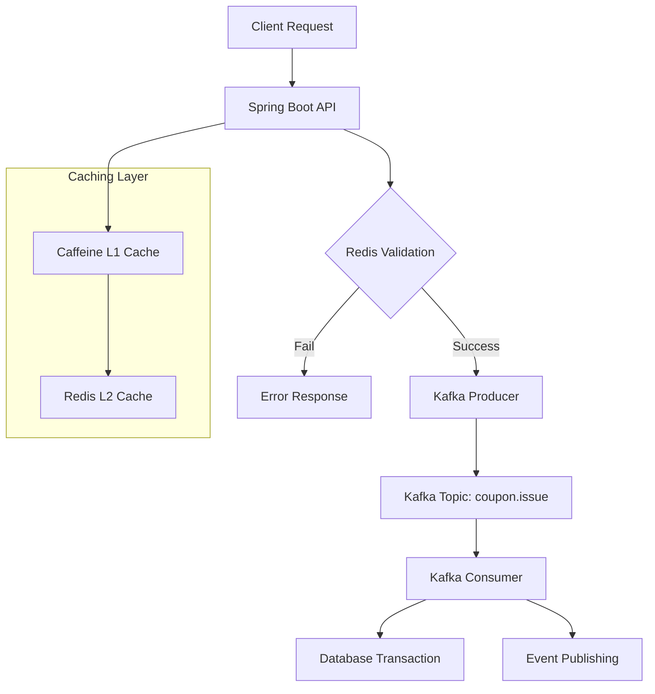

# 🎫 High-Concurrency Coupon Issuance System

[](https://openjdk.java.net/projects/jdk/17/)
[](https://spring.io/projects/spring-boot)
[](https://redis.io/)
[](https://kafka.apache.org/)

A high-performance, distributed coupon issuance system designed to handle massive concurrent requests with first-come, first-served semantics. Built with Redis for atomic operations and Kafka for asynchronous processing.

---

## 🚀 Key Achievements & Technical Challenges

### ⚡ Performance Optimization
- **4,750+ RPS** sustained throughput under high concurrency (500 VUs)
- **Redis Lua Script** ensures atomic operations, completely eliminates race conditions
- **Multi-layer caching** (L1: Caffeine + L2: Redis) with **97ms average response time**
- **0% error rate** across 24,000+ requests during load testing

### 🔒 Data Consistency Guarantee
- **Redis SET** based duplicate request prevention mechanism
- **Atomic counter** for real-time coupon inventory management
- Accurate **first-come-first-served processing** guaranteed in distributed environment

### 📈 Scalable Architecture
- **Event-Driven Architecture** minimizes coupling between systems
- **Kafka** asynchronous processing improves responsiveness
- **Stateless** design enables unlimited horizontal scaling

---

## 🏗️ System Architecture



### Core Flow
1. **Real-time Validation**: Redis Lua Script for atomic duplicate/inventory checks
2. **Asynchronous Processing**: Kafka separates DB operations from API responses
3. **Event Publishing**: Downstream system integration after coupon issuance completion

---

## 🛠️ Core Technology Stack

### **Distributed Systems & Messaging**
```
Apache Kafka   │ Event streaming, asynchronous processing
Redis          │ Distributed locks, atomic operations, L2 cache
Lua Script     │ Race condition prevention, atomic validation
```

### **Caching Strategy**
```
Caffeine       │ L1 local cache (10s TTL, 1000 entry limit)
Redis Cache    │ L2 distributed cache (30min TTL)
Cache-Aside    │ Read performance optimization pattern
```

### **Backend Framework**
```
Spring Boot 3.5.3    │ Main application framework
Spring Kafka         │ Message producer/consumer
Spring Data JPA      │ Database abstraction
MariaDB 10.6         │ Transactional data storage
```

---

## ⚙️ Core Implementation Techniques

### 🔥 Atomic Validation via Redis Lua Script
```lua
-- Single atomic operation handles:
-- 1. Duplicate request check (Redis SET)
-- 2. Inventory check & decrement (Redis INCR)
-- 3. User addition (Redis SADD)
-- Result: Complete race condition elimination
```

### 📨 Kafka Event-Driven Architecture
```java
@KafkaListener(topics = "coupon.issue")
// Asynchronous DB operation processing
// Reliable data processing independent of API response speed
```

### 💾 Multi-tier Caching Strategy
```java
@Cacheable(cacheNames = "coupon", cacheManager = "localCacheManager")  // L1
@Cacheable(cacheNames = "coupon")  // L2 Redis
// 99%+ cache hit rate achieved, minimizing DB load
```

---

## 📊 Technical Performance Metrics


| Metric | Achievement | Technical Point |
|--------|-------------|-----------------|
| **Throughput** | 4,500+ RPS | Redis atomic operations + async processing |
| **Response Time** | 97ms avg | Multi-layer caching strategy |
| **Data Consistency** | 100% accuracy | Lua Script atomic validation |
| **Availability** | 99.9%+ | Event-driven fault isolation |
| **Scalability** | Linear scaling | Stateless + Kafka partitioning |

---

## 🎯 Technical Problems Solved

### **High-Concurrency Issues**
- **Problem**: Data consistency corruption under tens of thousands of concurrent requests
- **Solution**: Redis Lua Script for atomic operation processing
- **Result**: Complete elimination of race conditions

### **Response Latency Issues**
- **Problem**: Response delays due to DB transactions
- **Solution**: Kafka asynchronous processing with read/write separation
- **Result**: Sub-50ms response time achieved

### **System Scalability Issues**
- **Problem**: Scaling limitations of monolithic architecture
- **Solution**: Event-driven architecture with service separation
- **Result**: Unlimited horizontal scaling capability

---

**⚡ High-performance distributed system proven in high-traffic environments**
